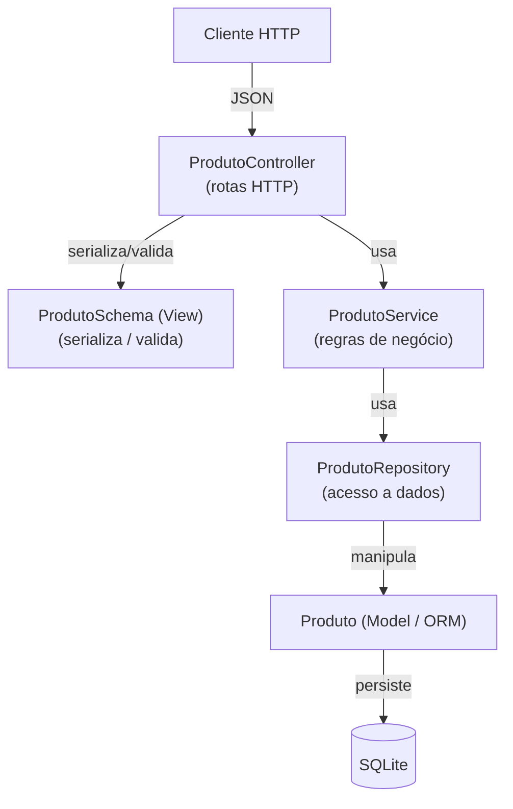

# API de Produtos (Desafio Final)

Minha entrega do desafio final do bootcamp de Arquiteto de Software (Faculdade XP).

É uma API de **Produto** em Flask, organizada no padrão MVC, com os dados num
SQLite. A ideia do enunciado era expor um catálogo pra parceiros consumirem via
REST. Diante disso, escolhi "Produto" por ser o tipo de dado que dá pra abrir para o
público sem vazar nada sensível de cliente.

Stack: Python 3.10+, Flask 3, Flask-SQLAlchemy, SQLite.

---

## O domínio: Produto

| Campo                | Tipo      | Descrição                         |
| -------------------- | --------- | --------------------------------- |
| `id`                 | int       | Identificador (auto-incremento)   |
| `nome`               | string    | Nome do produto (obrigatório)     |
| `descricao`          | string    | Descrição (opcional)              |
| `preco`              | decimal   | Preço >= 0 (obrigatório)          |
| `quantidade_estoque` | int       | Estoque >= 0 (default 0)          |
| `data_criacao`       | datetime  | Gerado automaticamente            |

---

## Endpoints

| Método   | Rota                    | Descrição                         | Status sucesso |
| -------- | ----------------------- | --------------------------------- | -------------- |
| `GET`    | `/produtos`             | **Find All** — lista todos        | `200`          |
| `GET`    | `/produtos/<id>`        | **Find By ID** — busca por ID     | `200` / `404`  |
| `GET`    | `/produtos/nome/<nome>` | **Find By Name** — busca por nome | `200`          |
| `GET`    | `/produtos/contar`      | **Count** — total de registros    | `200`          |
| `POST`   | `/produtos`             | **Create** — cria um produto      | `201` / `400`  |
| `PUT`    | `/produtos/<id>`        | **Update** — atualiza             | `200` / `400` / `404` |
| `DELETE` | `/produtos/<id>`        | **Delete** — remove               | `204` / `404`  |

A raiz (`GET /`) devolve um JSON com a lista de rotas, só pra facilitar quando
abro a API no navegador.

Uma decisão que tomei: o **Find By Name** não faz igualdade exata, faz "contém"
e ignora maiúscula/minúscula. Dessa forma, quem busca "mouse" quer achar
"Mouse sem fio" também.

---

## Como executar

Pré-requisito: Python 3.10+

```bash
# 1. Criar e ativar ambiente virtual
python -m venv venv
source venv/bin/activate        # Windows: venv\Scripts\activate

# 2. Instalar dependências
pip install -r requirements.txt

# 3. (Opcional) Popular o banco com dados de exemplo
python seed.py

# 4. Subir a API
python run.py
```

A API ficará disponível em **http://localhost:5000**.

### Rodar os testes

```bash
python -m pytest tests/test_api.py -v      # ou: python tests/test_api.py
```

São 10 testes em cima dos endpoints (CRUD, count, busca por nome, e os casos de
erro 400/404), rodando num SQLite em memória pra não poluir o banco de verdade.

Obs.: precisa de Python 3.10+ — uso anotação `X | None` em alguns lugares.

---

## Exemplos de uso (curl)

```bash
# Find All
curl http://localhost:5000/produtos

# Find By ID
curl http://localhost:5000/produtos/1

# Find By Name (parcial, case-insensitive)
curl http://localhost:5000/produtos/nome/mouse

# Count
curl http://localhost:5000/produtos/contar

# Create
curl -X POST http://localhost:5000/produtos \
  -H "Content-Type: application/json" \
  -d '{"nome":"Headset Gamer","descricao":"7.1 surround","preco":399.90,"quantidade_estoque":20}'

# Update
curl -X PUT http://localhost:5000/produtos/1 \
  -H "Content-Type: application/json" \
  -d '{"preco":5999.00}'

# Delete
curl -X DELETE http://localhost:5000/produtos/1
```

---

## Arquitetura

O caminho de uma requisição pelas camadas:



A explicação de cada camada e os diagramas (C4 + UML) estão em
[`docs/ARQUITETURA.md`](docs/ARQUITETURA.md). O `.drawio` editável fica em
[`docs/diagramas.drawio`](docs/diagramas.drawio) (abre no https://app.diagrams.net).

Resumindo o porquê das camadas: o Controller só cuida do HTTP, o Service tem a
regra de negócio e o Repository é o único que fala com o banco. Assim, se eu
trocar o SQLite por Postgres depois, mexo só no Repository.
