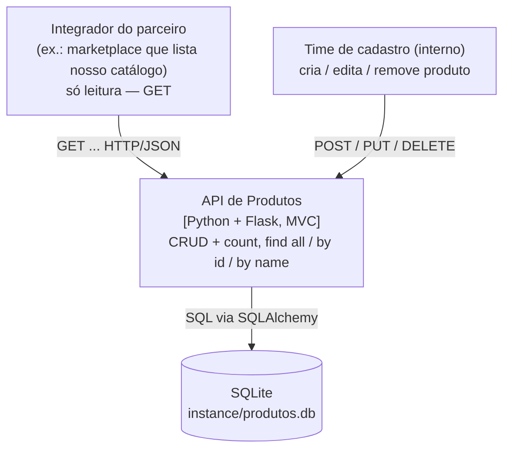
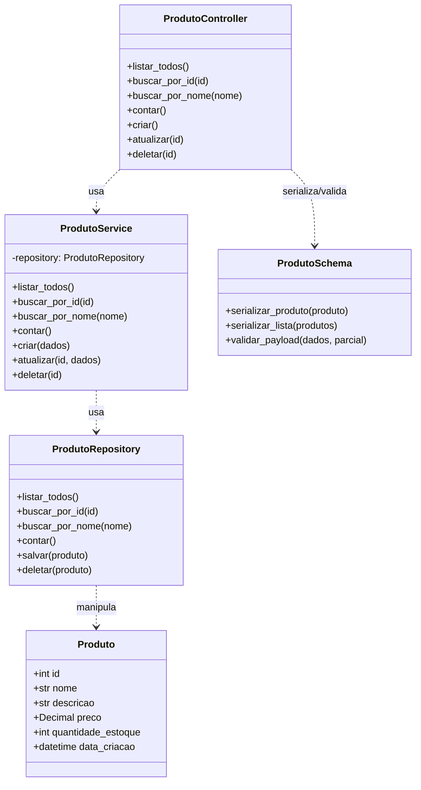

# Arquitetura

Anotações sobre como organizei a API de Produtos e por que cada parte está onde
está.

## Visão geral

É um MVC clássico, mas separei mais duas camadas que, para mim, fazem diferença no
back-end: **Service** (regra de negócio) e **Repository** (acesso a dados), enquanto o MVC
"puro" tende a empilhar tudo no Controller. Acredito que quebrar assim mantém cada arquivo
com um trabalho só.

O caminho de uma requisição é o seguinte:

```
HTTP → Controller → Service → Repository → Model → Banco (SQLite)
                 ↘ Schema (View) valida a entrada e serializa a saída ↙
```

A regra que tentei seguir: cada camada só conversa com a de baixo. Na prática
isso dá liberdade de mexer em uma sem quebrar as outras. Trocar o banco é só
no Repository, mudar a regra é só no Service, e o formato do JSON é só no Schema.

---

## Estrutura de pastas

```
desafio-final-api/
│
├── run.py                      # Ponto de entrada (sobe o servidor Flask)
├── seed.py                     # Popula o banco com dados de exemplo
├── requirements.txt            # Dependências
├── README.md                   # Guia de uso
│
├── app/                        # Pacote principal da aplicação
│   ├── __init__.py             # Application Factory: monta a app, registra tudo
│   ├── config.py               # Configuração por ambiente (dev/test/prod)
│   ├── extensions.py           # Instância única do ORM (db = SQLAlchemy())
│   │
│   ├── models/                 # [M] MODEL — entidades de domínio + ORM
│   │   └── produto.py
│   │
│   ├── schemas/                # [V] VIEW — serialização/validação (JSON)
│   │   └── produto_schema.py
│   │
│   ├── controllers/            # [C] CONTROLLER — rotas HTTP (Blueprints)
│   │   └── produto_controller.py
│   │
│   ├── services/               # SERVICE — regras de negócio / casos de uso
│   │   └── produto_service.py
│   │
│   ├── repositories/           # REPOSITORY — acesso a dados (fala com o ORM)
│   │   └── produto_repository.py
│   │
│   └── errors/                 # Exceções de domínio + handlers globais
│       ├── exceptions.py
│       └── handlers.py
│
├── tests/                      # Testes automatizados
│   └── test_api.py
│
├── instance/                   # Banco SQLite (gerado em runtime)
│   └── produtos.db
│
└── docs/                       # Documentação e diagramas
    ├── ARQUITETURA.md
    └── diagramas.drawio        # C4 (Container + Component) + UML de classes
```

---

## O que cada parte faz

**Model** (`app/models/produto.py`) — o "M". É só a entidade `Produto` mapeada
pra tabela. Sem regra de negócio, sem HTTP, só os campos.

**Schema / View** (`app/schemas/produto_schema.py`) — o "V" (que numa API
acaba sendo o JSON). Faz as duas pontas: serializa o Model na saída
e valida o que chega na entrada (alertando quando o dado vem errado).

**Controller** (`app/controllers/produto_controller.py`) — o "C". São as rotas
(Blueprint do Flask). Ele lê a requisição, chama o Schema pra validar, chama o
Service e devolve o status certo. De propósito, não tem regra nem SQL aqui.

**Service** (`app/services/produto_service.py`) — onde fica a regra de negócio.
Por exemplo, é ele que decide lançar "não encontrado" quando o id não existe.

**Repository** (`app/repositories/produto_repository.py`) — o único que tangencia
no SQLAlchemy. Centralizei o acesso ao banco justamente para poder
trocar de SGBD depois sem espalhar mudança pelo resto.

**Errors** (`app/errors/`) — exceções (`RecursoNaoEncontradoError`,
`ValidacaoError`) e os handlers que as transformam em JSON com o status certo
(400/404/405/500). Fiz assim pra não ter `try/except` repetido em todo Controller.

**create_app** (`app/__init__.py`) — a fábrica que monta tudo: config, banco,
Blueprints e handlers. Nos testes eu subo uma instância separada com banco em memória.

## Por que algumas escolhas

- **Service e Repository separados:** poderia ter colocado tudo no Controller, mas
  aí ele ficaria muito grande. Separado, cada coisa fica testável e no seu canto.
- **Schema fazendo o papel de View:** numa API REST não tem tela, então faz
  sentido o "V" ser a camada que cuida do JSON (entrada e saída).
- **Injeção de dependência no Service:** o `ProdutoService` aceita receber um
  repository no construtor, o que ajuda a mockar nos testes.
- **SQLite:** escolhi por não precisar instalar nada — sobe junto com a app. Sendo possível
  trocar por Postgres só apontando a `DATABASE_URL`.

---

## Diagramas

Deixei em dois formatos:

- **Editável:** [`diagramas.drawio`](diagramas.drawio): abrir em
  <https://app.diagrams.net>. Contém as três visões abaixo.
- **Renderizado (Mermaid):** incorporado a seguir, renderiza direto no GitHub
  ou em <https://mermaid.live>.

### C4 — Container

Separei os dois tipos de quem usa a API: o pessoal de fora, que só lê o
catálogo, e o pessoal interno, que cadastra/edita. Os dois batem na mesma API,
mas com verbos diferentes.



> Hoje a API não diferencia quem lê de quem escreve (não tem auth). Num cenário
> real eu colocaria pelo menos uma chave de API para o parceiro.

### C4 — Component (dentro da API)

```mermaid
flowchart TB
    cliente["Cliente HTTP"]
    controller["ProdutoController<br/>(rotas HTTP / Blueprint)"]
    schema["ProdutoSchema (View)<br/>(serializa / valida JSON)"]
    service["ProdutoService<br/>(regras de negócio)"]
    repo["ProdutoRepository<br/>(acesso a dados)"]
    model["Produto (Model / ORM)"]
    db[("SQLite")]
    cliente -->|JSON| controller
    controller -->|serializa/valida| schema
    controller -->|usa| service
    service -->|usa| repo
    repo -->|manipula| model
    model -->|persiste (SQL)| db
```

### UML — Classes



As três visões correspondem exatamente às abas do arquivo `diagramas.drawio`.
